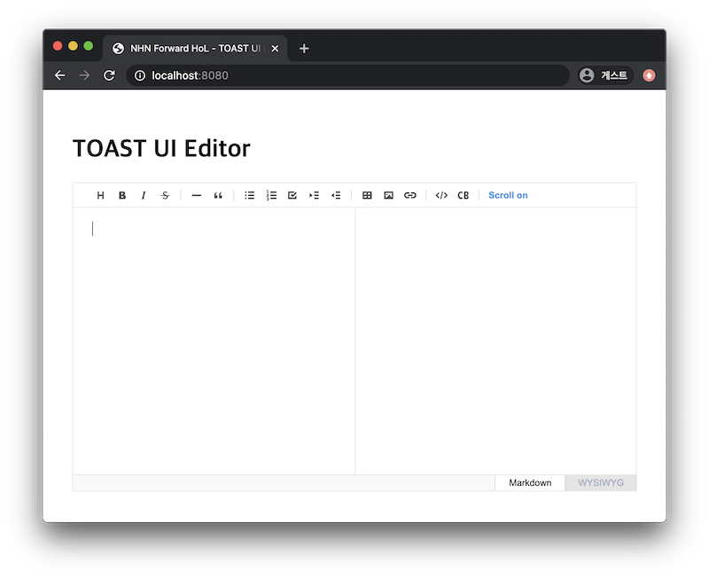

##############################
에디터 생성하기
##############################

HTML 초기 코드 작성
==============================

준비된 ``src/index.html`` 파일을 열어 ``body`` 태그 내부에 컨테이너 태그를 작성해 줍니다.

.. code-block:: html

  // src/index.html

  <body>
    ...
    

    ...
  </body>

자바스크립트 초기 코드 작성
==============================

1. 인스턴스를 생성해봅니다. 이때 반드시 기본 옵션을 파라미터로 넘겨주어야 합니다.
``src/index.js`` 파일을 열고 다음 코드를 추가해봅니다.

* 기본 옵션 정보
    
    * ``el`` : 에디터가 생성되는 컨테이너 엘리먼트 지정
    * ``initialEditType`` : 에디터 초기 모드를 지정 (``'markdown'`` 또는 ``'wysiwyg'``)
    * ``previewStyle`` : 마크다운 모드는 편집 중인 콘텐츠의 모습을 미리 볼 수 있는 프리뷰의 UI 형태를 지정 (``'tab'`` 또는 ``'vertical'``)
    * ``height`` : 에디터 편집 영역의 높이 지정
    * ``initialValue`` : 에디터에 초기 콘텐츠 값을 마크다운 텍스트로 지정

* 더 많은 옵션 보기 : |link|

.. |link| raw:: html 

  <a href="https://nhn.github.io/tui.editor/latest/ToastUIEditor" target="_blank">링크</a>

.. code-block:: javascript

  // src/index.js

  import 'codemirror/lib/codemirror.css'; // codemirror 스타일
  import 'highlight.js/styles/github.css'; // code block highlight 스타일
  import 'tui-editor/dist/tui-editor.css'; // 에디터 기본 UI 스타일
  import 'tui-editor/dist/tui-editor-contents.css'; // 에디터 콘텐츠 영역 스타일
  
  import Editor from 'tui-editor';

  const editor = new Editor({ // 에디터 인스턴스 생성
    el: document.querySelector('#editor'),
    initialEditType: 'markdown',
    previewStyle: 'vertical',
    height: '500px'
  });

2. 개발 서버에 접속한 브라우저에서 에디터가 생성되었는지 확인합니다.
코드를 수정하면 브라우저는 자동으로 리프레시됩니다.

결과 화면
==============================

