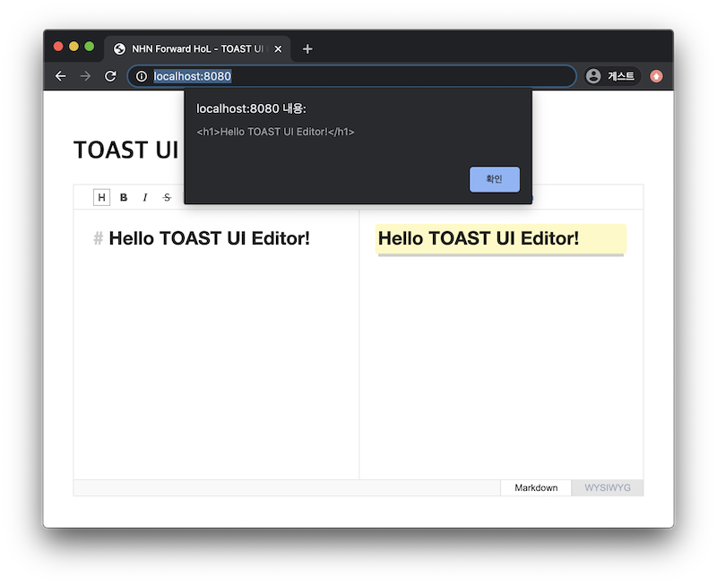

##################################
콘텐츠 저장과 로드하기
##################################

TOAST UI Editor는 기본적으로 마크다운 텍스트로 입력받고 출력합니다.
에디터를 사용하는 유저는 마크다운 모드에서 혹은 위지윅 모드에서 문서를 편집할 수 있지만 편집된 내용을 저장할 때는 마크다운 텍스트로 저장됩니다.
하지만 개발 편의를 위해 HTML 데이트를 입력하거나 출력할 수 있는 API도 제공하고 있습니다.

index.js 파일 하단에 아래의 코드를 입력해 각 API 호출 결과를 확인해 봅니다.

=============
HTML
=============

- ``setHtml(html)`` : 인자로 전달하는 HTML 텍스트로 에디터의 콘텐츠를 변경합니다.
- ``getHtml()`` : 현재 편집 중인 콘텐츠를 HTML 텍스트로 받습니다.

.. code-block:: javascript

  editor.setHtml('<h1>Hello TOAST UI Editor!</h1>');

  alert(editor.getHtml());

결과 화면
==============================

=============
Markdown
=============

- ``setMarkdown(markdown)`` : 인자로 전달하는 마크다운 텍스트로 에디터의 콘텐츠를 변경합니다.
- ``getMarkdown()`` : 현재 편집 중인 콘텐츠를 마크다운 텍스트로 받습니다.

.. code-block:: javascript
                  
  editor.setMarkdown('# Hello NHN Forward!');
  
  alert(editor.getMarkdown());

결과 화면
==============================

.. image:: _static/step04-2.png