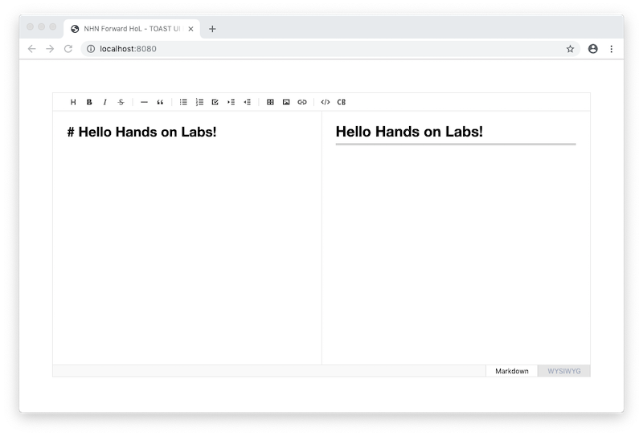

##################################
플러그인 추가하기
##################################

TOAST UI Editor는 다양한 플러그인을 제공하고 있습니다.

|차트|, |UML|, |셀 병합 테이블|, |컬러 신택스|, |코드 신택스 하이라이팅| 총 5가지의 기본 플러그인을 제공하며, 사용자가 직접 플러그인을 구현할 수도 있습니다.

.. |차트| raw:: html 

  <a href="https://github.com/nhn/tui.editor/tree/master/plugins/chart" target="_blank">차트</a>

.. |UML| raw:: html 

  <a href="https://github.com/nhn/tui.editor/tree/master/plugins/uml" target="_blank">UML</a>

.. |셀 병합 테이블| raw:: html 

  <a href="https://github.com/nhn/tui.editor/tree/master/plugins/table-merged-cell" target="_blank">셀 병합 테이블</a>

.. |컬러 신택스| raw:: html 

  <a href="https://github.com/nhn/tui.editor/tree/master/plugins/color-syntax" target="_blank">컬러 신택스</a>

.. |코드 신택스 하이라이팅| raw:: html 

  <a href="https://github.com/nhn/tui.editor/tree/master/plugins/code-syntax-highlight" target="_blank">코드 신택스 하이라이팅</a>


플러그인을 정의하고 사용하는 방법을 익혀봅시다.

*- 주의: 4장에서 실습했던 HTML 및 마크다운 관련 API 호출 코드는 제거하고 작성합니다.*

==============================
플러그인 설치 및 가져오기
==============================

TOAST UI Editor의 각 플러그인은 npm 패키지로 제공합니다.
플러그인을 사용하려면 에디터를 설치할 때와 같이 npm으로 패키지를 설치한 다음 모듈로 가져와서 사용해야 합니다.

예제에서는 **차트 플러그인** 을 사용해보도록 하겠습니다.
먼저 ``npm install`` 을 실행하여 차트 플러그인을 설치합니다.

.. code-block:: shell

  npm install @toast-ui/editor-plugin-chart


설치가 완료되면 **index.js** 파일을 열고 플러그인과 관련된 모듈들을 가져오는 코드를 파일 상단에 추가합니다.

.. code-block:: javascript

  import 'codemirror/lib/codemirror.css';
  import '@toast-ui/editor/dist/toastui-editor.css';
  import 'tui-chart/dist/tui-chart.css'; // 추가 - 차트 스타일

  import Editor from '@toast-ui/editor';
  import chart from '@toast-ui/editor-plugin-chart'; // 추가 - 차트 플러그인

  // ...

==============================
플러그인 활성화하기
==============================

TOAST UI Editor서 플러그인을 활성화하려면 ``plugins`` 옵션을 사용합니다.
``plugins`` 옵션 값은 배열이며 모듈로 가져온 플러그인 함수나 직접 구현한 플러그인 함수를 배열에 추가합니다.

.. code-block:: javascript

  import 'codemirror/lib/codemirror.css';
  import '@toast-ui/editor/dist/toastui-editor.css';
  import 'tui-chart/dist/tui-chart.css';

  import Editor from '@toast-ui/editor';
  import chart from '@toast-ui/editor-plugin-chart';

  const editor = new Editor({
    // ...
    plugins: [chart]
  });


차트 플러그인은 |마크다운 코드 블록 구문| 을 사용하여 데이터를 입력하고 화면에 출력할 수 있습니다.
마크다운 에디터 영역에 다음과 같이 입력하고 프리뷰 화면에 차트가 출력되는지 확인합니다.

.. |마크다운 코드 블록 구문| raw:: html 

  <a href="https://spec.commonmark.org/0.29/#example-89" target="_blank">마크다운 코드 블록 구문</a>


.. code-block:: md

  ```chart
  ,category1,category2
  Jan,21,23
  Feb,31,17

  type: column
  title: Monthly Revenue
  x.title: Amount
  y.title: Month
  y.min: 1
  y.max: 40
  y.suffix: $
  ```

==============================
결과 화면
==============================

차트 플러그인 실행 결과
==============================



