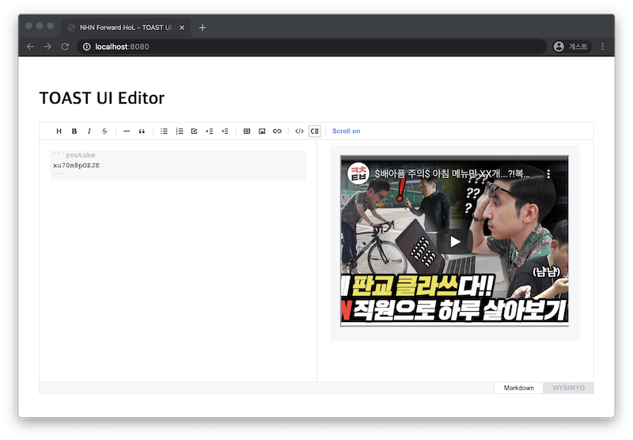

##################################
유튜브 익스텐션 개발하기
##################################

이제 간단한 익스텐션을 개발해보겠습니다.
기능은 **간단한 문법으로 유튜브 영상을 콘텐츠에 포함할 수 있는 익스텐션** 입니다.
이 익스텐션을 구현하기 전에 필요한 API부터 확인해 보겠습니다.


codeBlockManager 사용
==============================

**codeBlockManager** 은 마크다운 코드의 코드 블록에 관련된 기능들이 모여있는 모듈입니다.

우리는 마크다운 코드 블록을 확장해서 코드 블록이 유튜브 영상으로 변환되도록 만들 것입니다.
아래 코드와 같이 ``codeBlockManager`` 의 ``setReplacer`` 메서드를 사용합니다.
코드 블록 사용 언어로, ``'youtube'`` 를 사용합니다.

.. code-block:: javascript

  // ...

  Editor.defineExtension('youtube', () => {
    Editor.codeBlockManager.setReplacer('youtube', code => `play youtube id: ${code}`);
  });

  const editor = new Editor({
    // ...,
    exts: ['youtube']
  });

브라우저가 리프레시되면 익스텐션 동작을 확인하고, 마크다운 에디터에 직접 아래 코드 블록을 입력해봅니다.

.. code-block:: md

  ```youtube
  Hello TOAST UI Editor!
  ```

프리뷰 창을 확인하면 마크다운 코드 블록이 입력한 내용이 익스텐션에 의해 변환되어 출력됩니다.


유튜브 영상 추가
==============================

이제 유튜브 동영상으로 변환해봅니다.

유튜브 동영상은 ``iframe`` 으로 쉽게 삽입할 수 있지만 보안 이슈로 TOAST UI 에디터는 ``iframe`` 을 모두 제거합니다.
그래서 ``div`` 를 하나 만들고 다음 프레임에 ``iframe`` 을 추가합니다.

.. code-block:: javascript

  // ...

  Editor.defineExtension('youtube', () => {
    Editor.codeBlockManager.setReplacer('youtube', youtubeId => {
      const wrapperId = `yt${Math.random().toString(36).substr(2, 10)}`;

      setTimeout(renderYoutube.bind(null, wrapperId, youtubeId), 0);
      
      return `<div id="${wrapperId}"></div>`;
    });
  });

  function renderYoutube(wrapperId, youtubeId) {
    const el = document.querySelector(`#${wrapperId}`);
    el.innerHTML = `<iframe width="420" height="315" src="https://www.youtube.com/embed/${youtubeId}"></iframe>`;
  }

  // ...

에디터에서 코드 블록을 수정합니다.
코드 블록 내용에 **유튜브 영상 주소** 를 입력합니다.

.. code-block:: md
                
  ```youtube
  xu70m8pOZJE
  ```  
                
마지막으로 프리뷰창을 확인하면 유튜브 영상이 나올 것입니다.


결과 화면
==============================




축하합니다. TOAST UI Editor의 첫 익스텐션을 완성했습니다! 🎉

